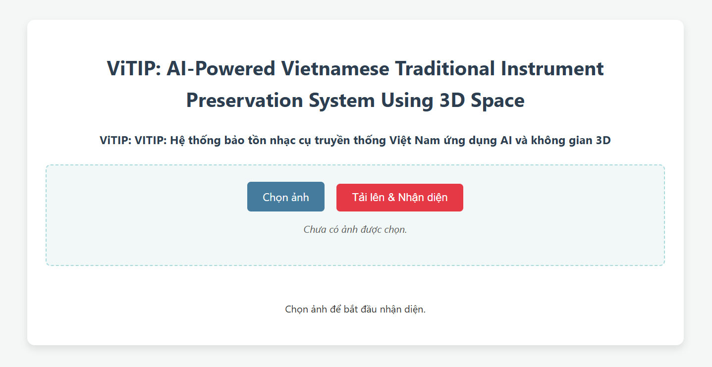
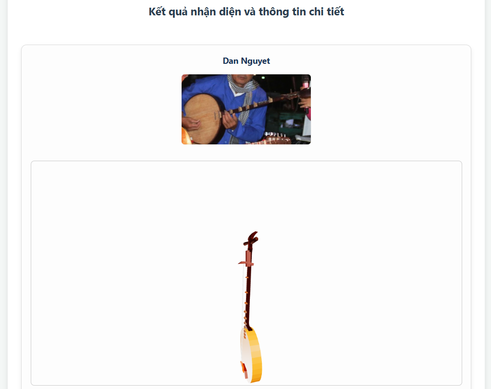

# 🎼 ViTIP: AI-Powered Vietnamese Traditional Instrument Preservation System Using 3D Space

## 💡 Giới thiệu

**ViTIP** (Vietnamese Traditional Instrument Preservation) là một hệ thống ứng dụng web sử dụng Trí tuệ nhân tạo để nhận diện và cung cấp thông tin chi tiết về các nhạc cụ truyền thống Việt Nam. Dự án này không chỉ tập trung vào khả năng nhận diện hình ảnh mà còn tích hợp dữ liệu Ontology và mô hình 3D tương tác, mang đến một trải nghiệm học tập và khám phá phong phú về di sản văn hóa âm nhạc Việt Nam.

Hệ thống này là kết quả của nghiên cứu đã được xuất bản:

**[ViTIP: AI-Powered Vietnamese Traditional Instrument Preservation System Using 3D Space](https://link.springer.com/chapter/10.1007/978-3-031-60295-8_7)**

## ✨ Tính năng chính

* **Tải ảnh & Nhận diện:** Dễ dàng tải lên hình ảnh chứa nhạc cụ và nhận diện tức thì.
* **Phân loại chính xác:** Sử dụng kết hợp mô hình YOLOv5 (phát hiện đối tượng) và LeNet (phân loại chi tiết) để đạt độ chính xác cao.
* **Thông tin Ontology:** Cung cấp thông tin chuyên sâu về từng nhạc cụ (lịch sử, cấu tạo, cách chơi, xuất xứ, v.v.) được trích xuất từ cơ sở tri thức Ontology.
* **Mô hình 3D tương tác:** Trực quan hóa nhạc cụ với mô hình 3D chất lượng cao, cho phép người dùng xoay, phóng to/thu nhỏ để khám phá các chi tiết.
* **Video học hỏi:** Hiển thị các video YouTube liên quan đến nhạc cụ và các loại hình nghệ thuật biểu diễn.

## 🚀 Công nghệ sử dụng


| Lĩnh vực    | Công nghệ             | Mô tả                                      |
| :---------- | :-------------------- | :----------------------------------------- |
| **Backend** | `Flask`               | Framework web Python nhẹ và mạnh mẽ.         |
|             | `PyTorch / YOLOv5`    | Phát hiện và khoanh vùng nhạc cụ trong ảnh.  |
|             | `TensorFlow / Keras`  | Phân loại chi tiết nhạc cụ (sử dụng LeNet). |
|             | `Owlready2`           | Làm việc với Ontology (file `.owl`).        |
|             | `Pillow (PIL)`        | Xử lý và tiền xử lý hình ảnh.               |
|             | `Python`              | Ngôn ngữ lập trình chính.                   |
| **Frontend**| `HTML5`, `CSS3`, `JS` | Xây dựng giao diện người dùng tương tác.    |
|             | `Three.js`            | Thư viện JavaScript cho đồ họa 3D (GLTFLoader, OrbitControls). |
| **Dữ liệu** | `Ontology (.owl)`     | Cơ sở tri thức về nhạc cụ truyền thống Việt Nam. |

## 📁 Cấu trúc thư mục
```
web/
├── app.py                      # Logic chính của ứng dụng Flask và các routes API
├── utils.py                    # Các hàm tiện ích (nhận diện, truy vấn ontology)
├── requirements.txt            # Danh sách các thư viện Python cần cài đặt
├── .env                        # File chứa biến môi trường (nếu có)
├── uploads/                    # Thư mục tạm lưu ảnh tải lên
├── static/
│   ├── predict/                # Ảnh đã được xử lý/nhận diện sẽ được lưu ở đây
│   └── model_3D/               # Chứa các thư mục con cho từng model 3D (ví dụ: dan_bau/)
│       ├── cong_chieng/
│       │   └── cong_chieng.gltf
│       ├── dan_bau/
│       │   └── dan_bau.gltf
│       └── ...                 # Các thư mục model 3D khác
├── templates/
│   └── index.html              # Giao diện người dùng chính (Frontend)
├── model/                      # Chứa các mô hình Machine Learning và Ontology
│   ├── model_yolo/
│   │   └── best.pt             # Mô hình YOLOv5 đã huấn luyện
│   ├── model_lenet/
│   │   └── lenet_model30.h5    # Mô hình LeNet đã huấn luyện
│   └── ontology/
│       └── nhaccu.owl          # File Ontology chứa thông tin nhạc cụ
└── README.md                   # File này
```
## 🛠️ Cài đặt và chạy dự án

Để triển khai và chạy dự án này trên máy cục bộ của bạn, vui lòng làm theo các bước dưới đây:

### 1. Chuẩn bị môi trường

* **Python 3.12:** Đảm bảo bạn đã cài đặt Python phiên bản 3.12.
* **pip:** Công cụ quản lý gói của Python (thường đi kèm với Python).
* **Git (Tùy chọn):** Nếu bạn muốn clone repository.

### 2. Tải mã nguồn

Clone repository hoặc tải file ZIP và giải nén:

```bash
git clone <đường_dẫn_đến_repository_của_bạn>
cd your_flask_app # Di chuyển vào thư mục dự án
```

### 3. Cài đặt thư viện Python
Khuyến nghị sử dụng môi trường ảo để quản lý các gói:
```bash
python -m venv venv
# Kích hoạt môi trường ảo:
# Trên Windows:
.\venv\Scripts\activate
# Trên macOS/Linux:
source venv/bin/activate
# Cài đặt các thư viện từ requirements.txt:
pip install -r requirements.txt
```

### 4. Đặt các mô hình và Ontology
Đảm bảo các file mô hình Machine Learning (best.pt, lenet_model30.h5) và file Ontology (nhaccu.owl) đã được đặt chính xác trong thư mục model/.

### 5. Đặt các mô hình 3D
Tạo thư mục static/model_3D/ và các thư mục con tương ứng cho từng nhạc cụ. Đặt các file .gltf của bạn vào đó.

### 6. Cập nhật MODEL_PATHS
Mở templates/index.html và chỉnh sửa biến MODEL_PATHS trong thẻ <script> để khớp với tên lớp nhạc cụ và đường dẫn tới file .gltf của bạn. Để trống chuỗi ('') nếu không có mô hình 3D cho nhạc cụ đó.
```bash
const MODEL_PATHS = {
    'cong_chieng': '/static/model_3D/cong_chieng/cong_chieng.gltf',
    'dan_bau': '/static/model_3D/dan_bau/dan_bau.gltf',
    'dan_co': '/static/model_3D/dan_co/dan_co.gltf',
    'dan_da': '/static/model_3D/dan_da/dan_da.glt
    'dan_day': '', // Ví dụ: Chưa có model cho Đàn đáy
    // ... các ánh xạ khác
};
```

### 7. Chạy ứng dụng
```bash
python app.py
```
Ứng dụng sẽ bắt đầu chạy trên http://127.0.0.1:5000/. Mở trình duyệt và truy cập địa chỉ này để bắt đầu sử dụng hệ thống.

## ✍️ Hướng dẫn sử dụng
* **Truy cập ứng dụng:** Mở trình duyệt và truy cập http://127.0.0.1:5000/.
* **Tải ảnh lên:** Nhấp vào nút "Chọn ảnh" và chọn một hình ảnh chứa nhạc cụ truyền thống Việt Nam.
* **Nhận diện:** Nhấn nút "Tải lên & Nhận diện". Hệ thống sẽ xử lý và hiển thị kết quả.
* **Khám phá kết quả:**
Xem ảnh đã được nhận diện với các hộp giới hạn và tên nhạc cụ.
Đọc thông tin chi tiết về nhạc cụ từ Ontology.
Tương tác với mô hình 3D (nếu có): dùng chuột để xoay, kéo, và cuộn để phóng to/thu nhỏ.
Xem các video liên quan để hiểu sâu hơn về nhạc cụ và các loại hình nghệ thuật liên quan.
## Demo hệ thống

<div style="display: flex; flex-direction: column;  justify-content: center; align-content: center; align-items: center; gap: 10px; ">
    
    
    
</div>


## ⚙️ Tùy chỉnh & Phát triển

* **Mở rộng nhạc cụ:** Huấn luyện thêm các mô hình ML với dữ liệu mới, cập nhật Ontology và thêm các mô hình 3D tương ứng.
* **Cải thiện UI/UX:** Tùy chỉnh file index.html và CSS để nâng cao trải nghiệm người dùng.
* **Tối ưu hóa hiệu suất:** Sử dụng các công cụ như gltf-pipeline để nén và tối ưu hóa các mô hình 3D.

## 🤝 Đóng góp

Mọi đóng góp để cải thiện dự án đều được chào đón! Vui lòng tạo một Issue hoặc Pull Request trên GitHub.

## Tác giả

- [@truongthanhma](https://github.com/truongthanhma)
- [@hieu10-06](https://github.com/hieu10-06)
- [@Michael-Ngn](https://github.com/Michael-Ngn)
- [@imxuan03](https://github.com/imxuan03)


